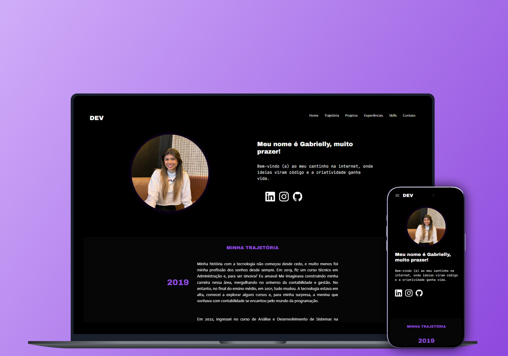

<h1 align="center">Portfólio Gabrielly Tegon</h1>

<p align="center">
  Meu espaço digital para compartilhar minha trajetória, experiências e projetos como desenvolvedora.  
</p>

<p align="center">
  <a href="#projeto">Projeto</a>&nbsp;&nbsp;&nbsp;|&nbsp;&nbsp;&nbsp;
  <a href="#tecnologias">Tecnologias</a>&nbsp;&nbsp;&nbsp;|&nbsp;&nbsp;&nbsp;
  <a href="#comoUsar">Como usar</a>
</p>

<p align="center">
  
</p>

<br>

<p align="center">
  
</p>

## 💻 Projeto <a id="projeto"></a>

Este portfólio foi desenvolvido para apresentar minha trajetória profissional e acadêmica, destacando experiências, habilidades técnicas e projetos realizados.

## 🚀 Tecnologias <a id="tecnologias"></a>

O portfólio foi desenvolvido com:

- React JS
- JavaScript
- HTML5 & CSS3
- AOS (Animate On Scroll)
- Bootstrap 

 👉 [Clique aqui para acessar o projeto!](https://portfolio-gabrielly-tegon.vercel.app/) 

## 📌 Como usar <a id="comoUsar"></a>

```bash
# Clone este repositório
git clone https://github.com/seu-usuario/seu-repo.git

# Acesse a pasta do projeto
cd portfolio

# Instale as dependências
npm install

# Inicie o servidor de desenvolvimento
npm run dev